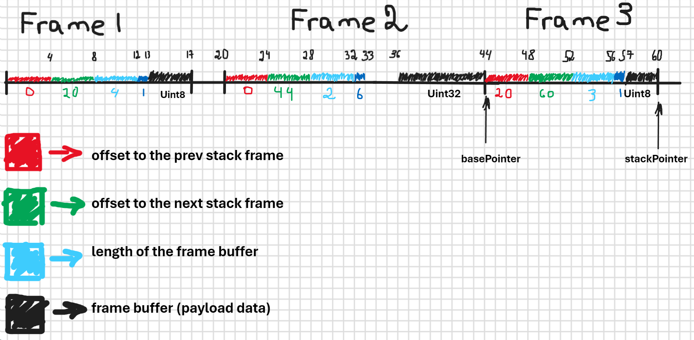

\*each cell takes 1 byte

# Lense

**.pop()**, **.peek()** and **.push()** returns **Lense**. **Lense** is handy way to work with frame buffers where the payload bytes is stored.

You care read and write data as if you were working with an array. Your requests such as **.get(idx)** **.set(idx)** takes indexes which are automatically coverted to the correct offsets.
