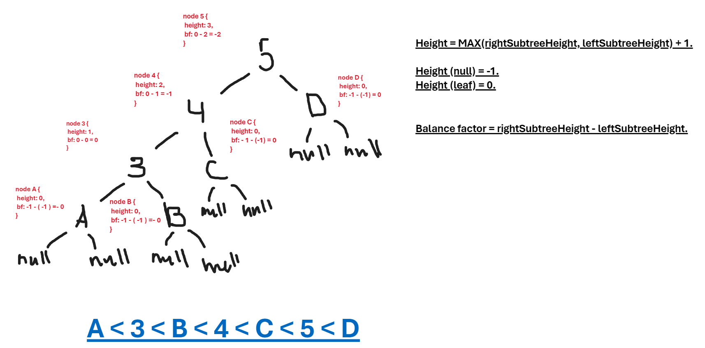
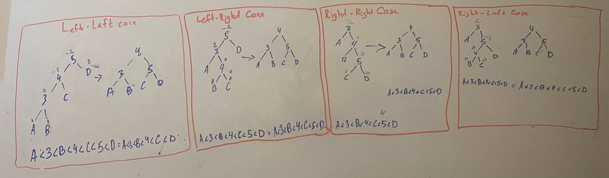

# AVL tree

An AVL tree is a self-balancing binary search tree (BST) where the difference in heights between the left and right subtrees (also known as the balance factor) of any node is at most 1. This ensures that the tree remains balanced and prevents the tree from becoming heavily skewed, which could lead to inefficient search, insertion, and deletion operations.

**AVL tree is not so useful as Red-Black tree, but it much better than BST.**

The property of balance is maintained through turns.

### Advantages:

- AVL trees are self-balancing, ensuring that operations like search, insertion, and deletion maintain a logarithmic time complexity, making them efficient for large datasets.
- The height of an AVL tree is always logarithmic, providing consistent and predictable performance for various operations.

### Disadvantages:

- Due to the additional balancing operations required to maintain AVL tree properties, insertions can be slower compared to non-self-balancing trees.
- Take more processing for balancing.

# Operations

## Insertion

### T -> O(Log(N))

### S -> O(Log(N))

I'm using recursively approach. That's why it takes so much space. It's pretty easy to write iterative approach, but I preffer recursively because it's more visual.

As you can see, it's pretty simple. We just have to find the leaf node and insert the needle.

## Removing

### T -> O(Log(N))

### S -> O(1)

## Finding

### T -> O(Log(N))

### S -> O(Log(N))

I'm using recursively approach. That's why it takes so much space. It's pretty easy to write iterative approach, but I preffer recursively because it's more visual.

## Itarators

There are also 3 type itearors introduced: **inorder**, **preorder** and **postorder**.

## Validator

If tree is not valid, then it returns false, otherwise true.
