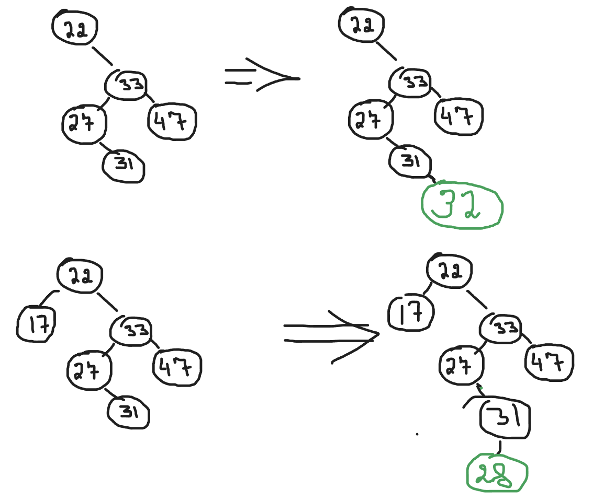
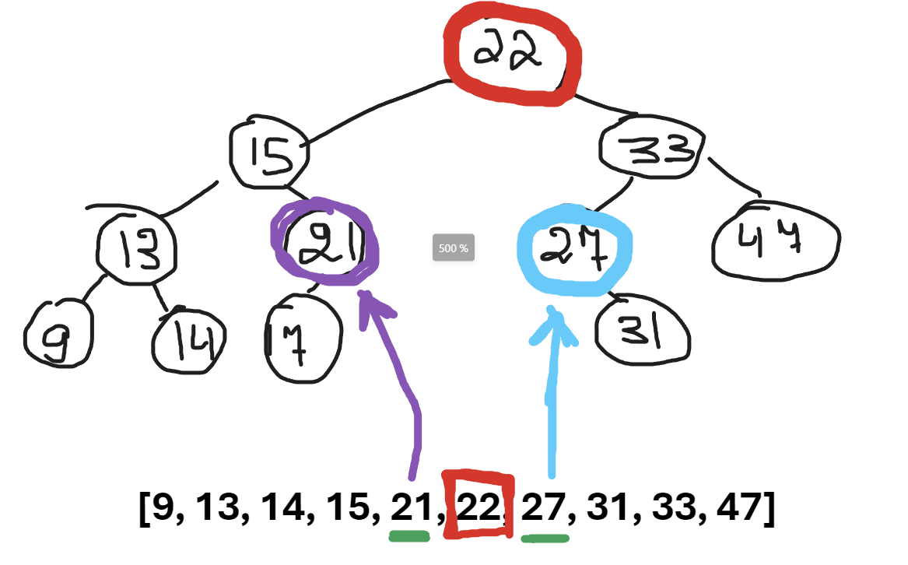
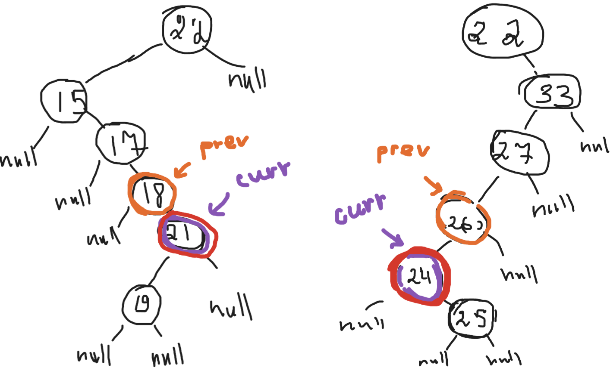

# Not balanced binary search tree (BST)

A Binary Search Tree (BST) is a data structure that organizes data in a hierarchical tree-like fashion. Each node has at most two child nodes, often referred to as the left child and the right child. The key property of a BST is that the value of nodes in the left subtree is less than the value of the parent node, and the value of nodes in the right subtree is greater than the value of the parent node.

**Unbalanced tree is not used anywhere. It's useless. It has been written just for learning purposes.**

### Advantages:

- Efficient search: BST provides a fast search operation with a time complexity of O(log N) for balanced trees on average, where N is the number of nodes.
- Easy to implement: BST is relatively simple to implement compared to other data structures like heaps or hash tables.

### Disadvantages:

- Imbalanced trees: In certain cases, BSTs can become unbalanced, leading to degraded performance with search operations approaching O(N) in the worst case.
- Memory overhead: BSTs can have significant memory overhead compared to arrays or linked lists due to the need to maintain pointers to child nodes.

# Operations

## Insertion

### T -> O(N)

- Average case: O(log N)
- Worst case: O(N) if the tree becomes unbalanced

### S -> O(N)

- Average case: O(log N)
- Worst case: O(N) if the tree becomes unbalanced

I'm using recursively approach. That's why it takes so much memory. It's pretty easy to write iterative approach, but I preffer recursively because it's more visual

As you can see, it's pretty simple. We just have to find the leaf node and insert the needle.

## Removing

### T -> O(N)

- Average case: O(log N)
- Worst case: O(N) if the tree becomes unbalanced

### S -> O(N)

- Average case: O(log N)
- Worst case: O(N) if the tree becomes unbalanced

It's little bit complicated than insertion operation.
Firstly, we have to find the node we want to remove. Then we have maintain the main property of BST : "The smallest elements goes to the left, the biggest in the right" (in my implementation the contract over the comparator function is responsible for this).

As I mentioned before, we have to maintain the structure of BST. We could either replace removed node with the greatest value from the it's left subtree or the smallest from the right.

it can be proved mathematically by inequalities, but for me it will be more simple to consider following trees.

Let's assume we want to remove **22**.

The only 2 nodes that are valid to replace **22** is **21** and **27**.

There is alsome some edge-cases if the leftmost value and rightmost value has it's own children. It's not to complicated, we just have to move some pointers around.

## Finding

### T -> O(N)

- Average case: O(log N)
- Worst case: O(N) if the tree becomes unbalanced

### S -> O(N)

- Average case: O(log N)
- Worst case: O(N) if the tree becomes unbalanced

It's just find nodes in the binary tree :).

## Itarators

There are also 3 type itearors introduced: **inorder**, **preorder** and **postorder**.

## Validator

If tree is not valid, then it returns false, otherwise true.
