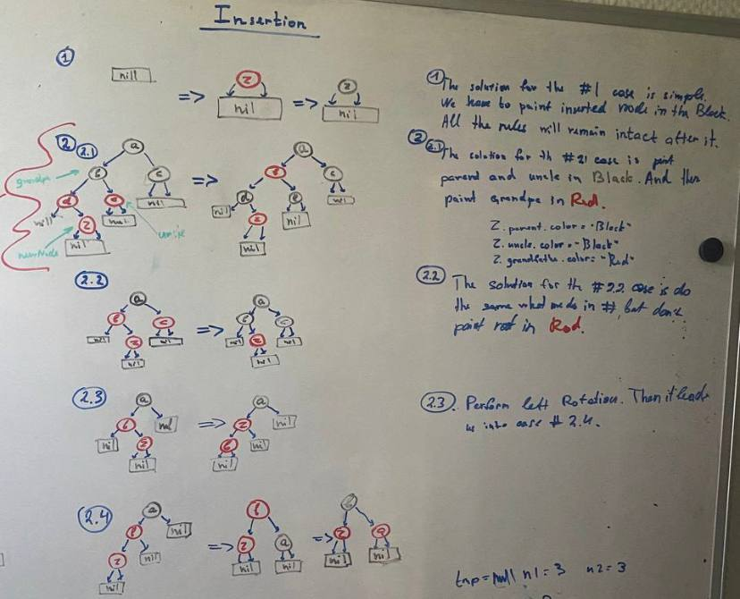
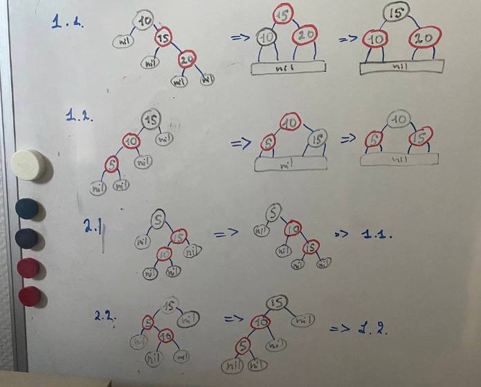

# Red-Black Tree

Red-Black Tree is a type of self-balancing binary search tree (BST) that maintains balance through a set of rules, ensuring efficient search, insertion, and deletion operations while preventing the tree from becoming heavily skewed.

Red-Black trees are designed to maintain balance through a set of colorings and rotations, which help to ensure that the longest path from the root to any leaf node is no more than twice the length of the shortest path.

## Validates Red-Black tree according to following rules:

1. All nodes should be painted at either 'Red' or 'Black.
2. The root should always be painted at 'Black'.
3. Each node should have at least 2 children. They could be leafs without values.
4. All red's children are black.
5. All nodes's 'black-height' should be equal

### Advantages:

- Red-Black trees offer efficient search, insertion, and deletion operations with a guaranteed logarithmic time complexity.
- They maintain balance through a limited set of rotations and color adjustments, ensuring consistent performance even for large datasets.
- Compared to AVL trees, Red-Black trees require fewer balancing operations, resulting in potentially faster insertions.

### Disadvantages:

- While Red-Black trees provide efficient operations, they may not be as strictly balanced as AVL trees, potentially leading to slightly longer search times in certain scenarios.
- The rules governing Red-Black trees can be more complex to implement and understand compared to simpler data structures like binary search trees.

# Operations

## Insertion

### T -> O(Log(N))

### S -> O(Log(N))

## Finding

### T -> O(Log(N))

### S -> O(Log(N))

## Iterators

There are also 3 type itearors introduced: **inorder**, **preorder** and **postorder**.

## Validator

The validator works accordingly to the rules represented at the beginning.
