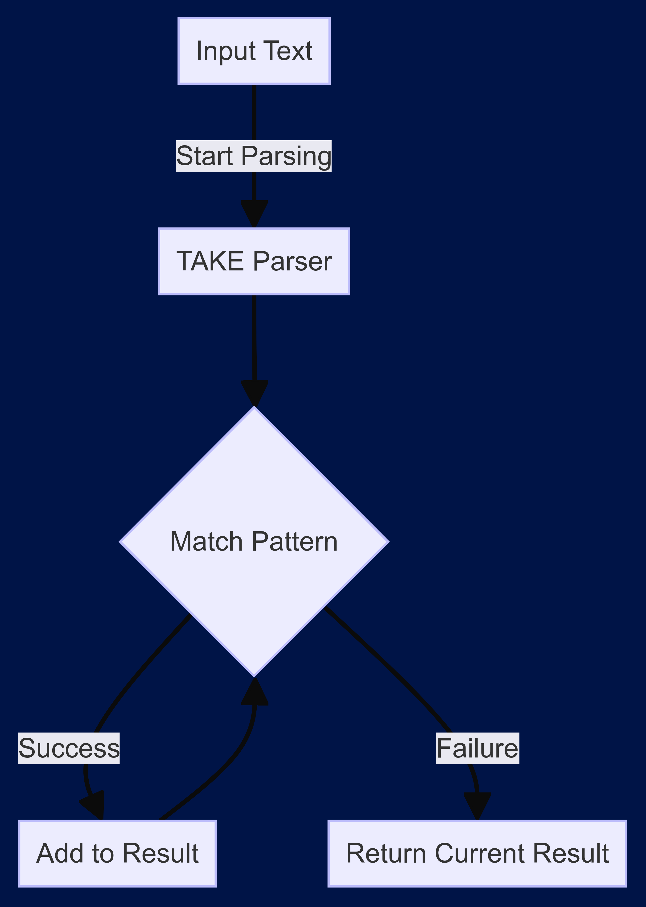
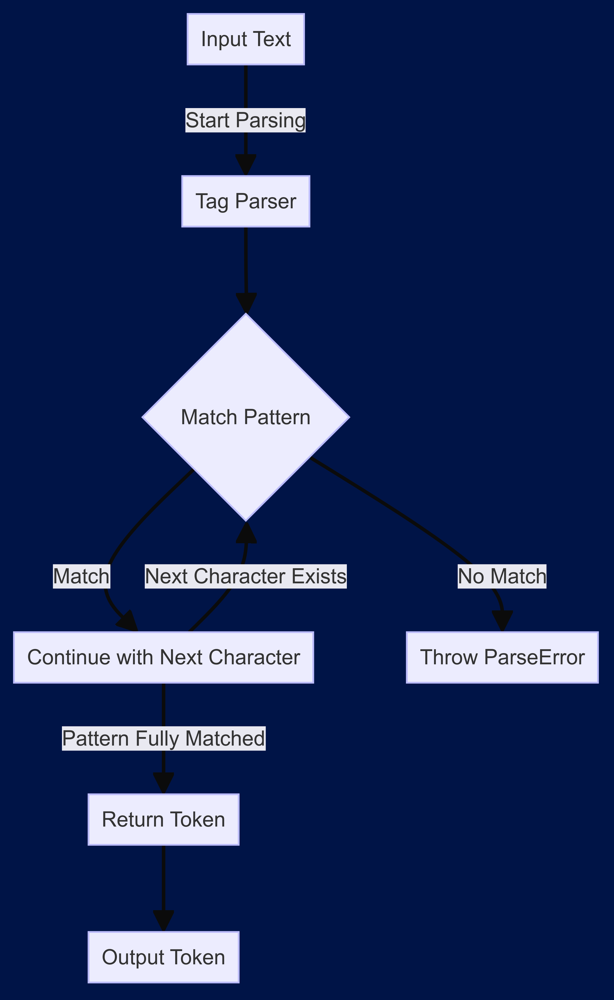
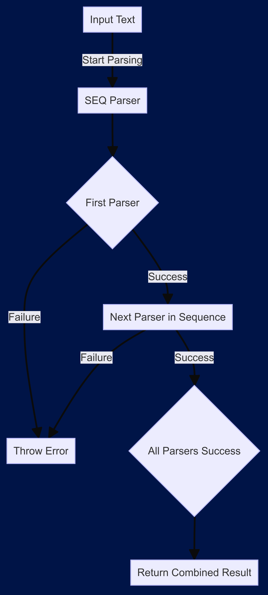
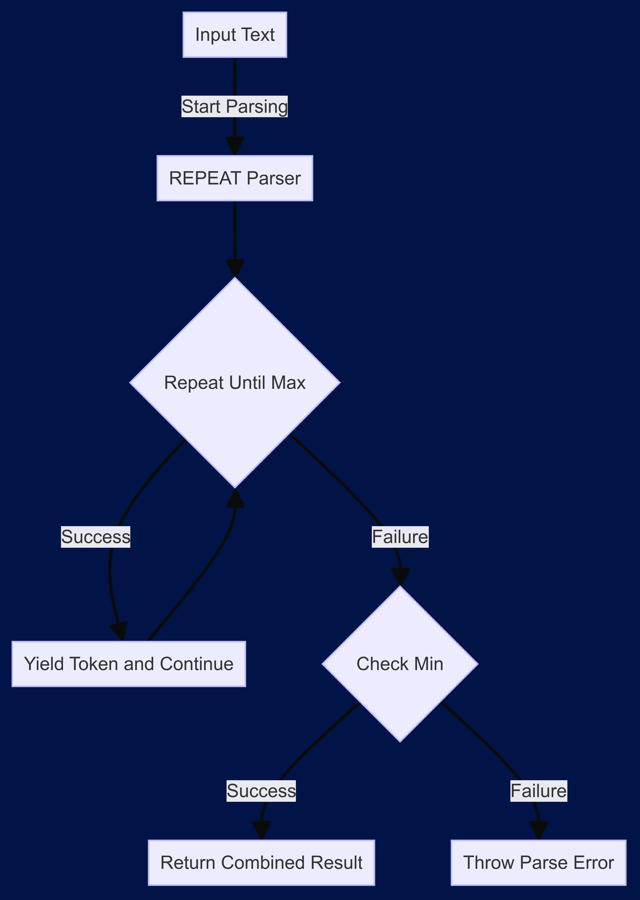
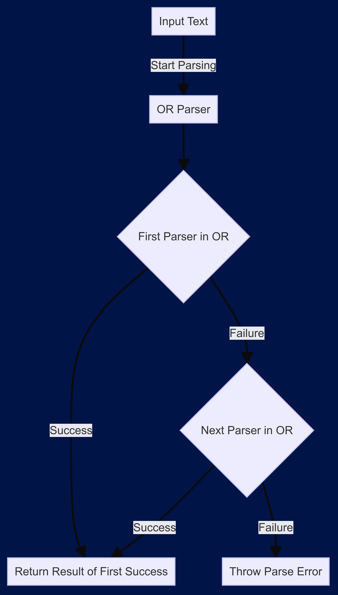
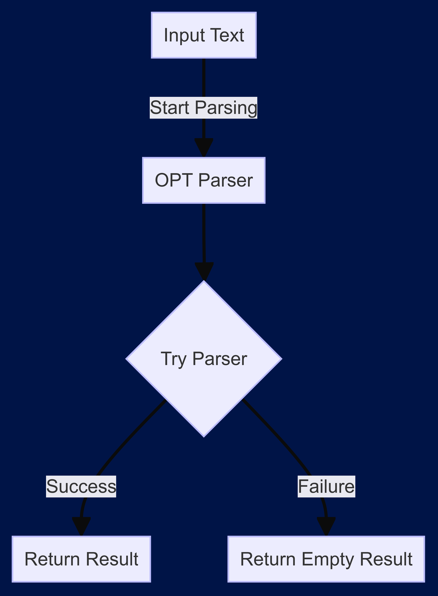

# Parser Combinators

Parser combinators are powerful tools in functional programming that allow for the composition of small, reusable parsers to create more complex parsers. This project provides a set of combinators for building parsers in a modular and declarative way.

## Table of Contents

- [Take](#take)
- [Tag](#tag)
- [Seq](#seq)
- [Repeat](#repeat)
- [Or](#or)
- [Opt](#opt)

## Take

The take parser extracts tokens from the input text that match a given pattern. It can be configured to stop after a certain number of matches.



### Usages

```javascript
const takeDigits = take(/\d/, { max: 2, min: 0 });
const result = takeDigits("1234 foo").next();
console.log(result); // { type: "TAKE", value: "12" }
```

## Tag

The tag parser checks if the input text starts with a specific pattern and extracts it as a token.



### Usages

```javascript
const tagParser = tag("hello");
const result = tagParser("hello world").next();
console.log(result); // { type: "TAG", value: "hello" }
```

## Seq

The seq parser processes multiple parsers in sequence and combines their results.



### Usages

```javascript
const fnExpr = seq(
  tag("function "),
  take(/[a-z_$]/i, { max: 3, min: 0 }),
  tag("()"),
)("function foo() {}"); // { type: "SEQ", value: "function foo()" }
```

## Repeat

The repeat parser repeatedly applies the provided parser to the input text and combines their results.



### Usages

```javascript
const repeatDigits = repeat(takeDigits, { max: 2, min: 1 });
const result = repeatDigits("1234 foo").next();
console.log(result); // { type: "REPEAT", value: "1234" }
```

## Or

The or parser tries multiple parsers in order and returns the result of the first successful parser.



### Usages

```javascript
const boolExpr = or(tag("true"), tag("false"))("false").next();
console.log(boolExrp); // { value: "false", type: "OR" }
```

## Opt

The OPT parser tries to parse with the provided parser and returns an empty result if it fails.



### Usages

```javascript
const takeNumbers = repeat(seq(take(/\d/, { min: 0, max: 3 }), opt(tag(","))), {
  max: 3,
  min: 0,
})("100,200,300");

console.log(takeNumbers.next().value, { type: "SEQ", value: "100," }); // { type: 'SEQ', value: '100,' } { type: 'SEQ', value: '100,' }
console.log(takeNumbers.next().value, { type: "SEQ", value: "200," }); // { type: 'SEQ', value: '200,' } { type: 'SEQ', value: '200,' }
console.log(takeNumbers.next().value, { type: "SEQ", value: "300" }); // { type: 'SEQ', value: '300' } { type: 'SEQ', value: '300' }
```
