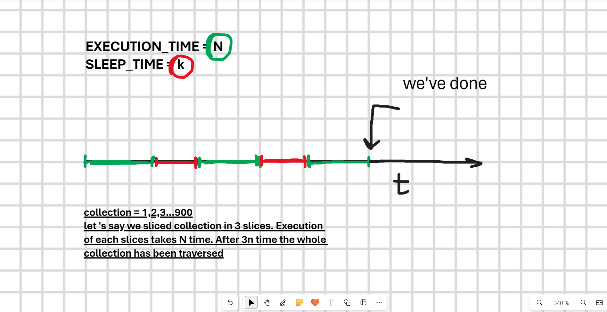

# Multithreading

## Table of Contents

1. [Basic](#basic)
   - [Promise](#promise)
   - [Threads](#threads)
   - [Generators](#generators)
2. [Concurrency](#concurrency)
   - [Task](#task)
   - [Scheduler](#scheduler)
3. [Priority](#priority)
   - [WithPriority](#withPriority)

## Basic

The main idea of the basic **forEach** implementation is to enhance the basic implementation of the **std::forEach** iterator with the ability to traverse enormous collections without blocking the main thread.

### Promise

The first idea is straightforward. We just yield all the time to the event loop.

```javascript
function forEach<T>(
  iterable: Iterable<T>,
  cb: (value: T) => void,
): Promise<number> {
  return new Promise((resolve) => {
    const start = Date.now();
    for (const value of iterable) {
      cb(value);
    }
    const end = Date.now();
    const diff = end - start;
    resolve(diff);
  });
}
```

### Threads

The second idea is to relieve the main thread by speeding up iterations with threads.

Firstly, the iterable should be sliced into chunks that will be processed in threads separately.

```javascript
const sliceCollection = <T>(collection: T[], pieces: number): T[][] => {
  const slices = [];
  const len = collection.length;
  const sliceSize = Math.ceil(len / pieces);

  let left = 0;
  let right = sliceSize;
  while (left < collection.length) {
    const slice = collection.slice(left, right);
    slices.push(slice);

    left = right;
    right += sliceSize;
  }

  return slices;
};
```

Then, it is paralleled in threads.

```javascript
const forEachParallel =
  <T>(iterable: Iterable<T>, cb: (value: T) => void) =>
  (threads: number): Promise<number> => {
    const { promise, resolve, reject } = Promise.withResolvers<number>();

    // 1. Slicing collection into itearble pieces of data based on the threads amount
    const collection = Array.from(iterable);
    const slicedCollection = sliceCollection(collection, threads);

    // 2. Paralleling
    let completedThreads = 0;

    /* TIME MEASUREMENTS */
    const start = Date.now();
    /* TIME MEASUREMENTS */

    const serializedCb = cb.toString();
    const errors: Error[] = [];

    for (const chunk of slicedCollection) {
      const workerPath = "./worker.js";
      const worker = new Worker(workerPath, {
        workerData: { chunk, cb: serializedCb },
      });
      worker.on("message", () => {
        completedThreads += 1;
        if (completedThreads === threads) {
          /* TIME MEASUREMENTS */
          const end = Date.now();
          /* TIME MEASUREMENTS */

          if (errors.length) reject(errors);
          else resolve(end - start);
        }
      });
      worker.on("error", (error) => {
        errors.push(error);
        completedThreads += 1;
        if (completedThreads === threads) reject(errors);
      });
    }

    return promise;
  };
```

### Generators

This is the most interesting approach for me. It is inspired by the nature of generators. We can 'freeze' the current state of our iterator for a time and then, during a certain amount of time, let the iterator work.



```javascript
import { setTimeout } from "timers/promises";

let EXECUTION_TIME = 1;
let SLEEP_TIME = 100;

async function* forEach<T>(iterable: Iterable<T>, cb: (value: T) => void) {
  let total = 0;
  let counter = 0;
  let sleep = false;
  let iter = iterable[Symbol.iterator]();

  while (true) {
    if (sleep) {
      sleep = false;
      counter = 0;
      await setTimeout(SLEEP_TIME);
      yield "Waked up";
    } else {
      const start = Date.now();
      const end = start + EXECUTION_TIME;

      while (Date.now() <= end) {
        const result = iter.next();
        if (result.done) {
          yield `${total} chunks has been executed`;
          return;
        }
        counter += 1;
        cb(result.value);
      }

      total += counter;
      sleep = true;

      yield `${counter} chunks were processed on iteration. ${total} chunks were processed`;
    }
  }
}
```

As you can see, the iterator will be executed during **EXECUTION_TIME** ms, and the rest of the code can occupy these time slices when the generator sleeps **(SLEEP_TIME)**.

## Concurrency

This works identically to the **generators** approach described in the previous paragraph. The difference is that in this example, we can handle multiple tasks simultaneously. We achieved this with the help of a **Scheduler**.

### Task

**Task** should be passed into **scheduler.enqueueTask**.

```javascript
import { Options } from "./types";

// Task fabric with configuration
const createTask = (options: Options) =>
  function* <T>(iterable: Iterable<T>, cb: (item: T) => void): Generator {
    let start = Date.now();
    let end = start + options.timeQuant;

    for (const item of iterable) {
      if (Date.now() > end) {
        const newStart = yield;
        start = newStart as number;
        end = start + options.timeQuant;
      }
      cb(item);
    }
  };
```

### Scheduler

Each time a task receives its time quant, it either completes or takes the last place in the queue.

```javascript
class Scheduler extends EventEmitter {
  state: SchedulerState;
  #queue: Generator<any>[];
  #options: Options;

  constructor(options: Options) {
    super();

    this.#options = options;
    this.state = SchedulerState.IDLE;
    this.#queue = [];
    // We should not block main thread
    // and make scheduler work only if we have tasks
    this.on(Commands.ENQUEUE_TASK, () => {
      console.log("emitted");
      if (this.state === SchedulerState.IDLE) {
        this.state = SchedulerState.IN_WORK;
        this.execute();
      }
    });
  }

  enqueueTask<T>(...tasks: Generator<T>[]) {
    this.#queue = this.#queue.concat(tasks);
    this.emit(Commands.ENQUEUE_TASK);
  }

  async execute() {
    // Task is an iterator
    let task = null;
    while ((task = this.#queue.shift())) {
      // Task should be able to track time
      // and exeucte each task during 'options.timeQuant' time
      let start = Date.now();
      const { done, value } = task.next(start);
      if (done) continue;
      // we should let rest code to be executed during 'options.gap' time
      await setTimeout(this.#options.timeGap);
      // enquing unfinfined task
      this.enqueueTask(task);
    }
    this.state = SchedulerState.IDLE;
  }
}
```

**Scheduler** wakes up when the new tasks being added and goes to sleep when there are no tasks to execute in the queue.

It's better to see it once than to read my description, isn't it? You can easily check this out with the following commands:

1. $ tsc forEachBasic.ts
2. $ node forEachBasic.js

## Priority

### WithPriority

It's identicall with previous **Concurrency**. The difference between it and **Priority** is that **Scheduler** uses PriorityQueue.

```javascript
num PRIORITIES {
  HIGH = 2,
  MEDIUM = 1,
  LOW = 0,
}
type PQItem<T> = {
  priority: PRIORITIES;
  value: Generator<T>;
};
type PQComparator<T> = (a: PQItem<T>, b: PQItem<T>) => boolean;

class SchedulerWithPriotity<T> extends EventEmitter {
  // max pq
  #queue: PriorityQueue<PQItem<T>>;
  #options: Options;
  state: SchedulerState;

  constructor(options: Options) {
    super();

    this.#options = options;
    const comparator: PQComparator<any> = (a, b) => a.priority > b.priority;
    this.#queue = new PriorityQueue([], comparator);
    this.state = SchedulerState.IDLE;
    // We should not block main thread
    // and make scheduler work only if we have tasks
    this.on(Commands.ENQUEUE_TASK, () => {
      console.log("emitted");
      if (this.state === SchedulerState.IDLE) {
        this.state = SchedulerState.IN_WORK;
        this.execute();
      }
    });
  }

  enqueueWithPriority(...tasks: PQItem<T>[]): void {
    for (const task of tasks) {
      this.#queue.push(task);
    }
    this.emit(Commands.ENQUEUE_TASK);
  }

  async execute() {
    // Task is an iterator
    let task: PQItem<T> | null = null;
    while ((task = this.#queue.shift())) {
      // Task should be able to track time
      // and exeucte each task during 'options.timeQuant' time
      let start = Date.now();
      const { done, value } = task.value.next(start);
      if (done) continue;
      // we should let rest code to be executed during 'options.gap' time
      await setTimeout(this.#options.timeGap);
      // enquing unfinfined task
      this.enqueueWithPriority(task);
    }
    this.state = SchedulerState.IDLE;
  }

  debugQueue() {
    return this.#queue;
  }

  shift() {
    return this.#queue.shift();
  }
}
```
